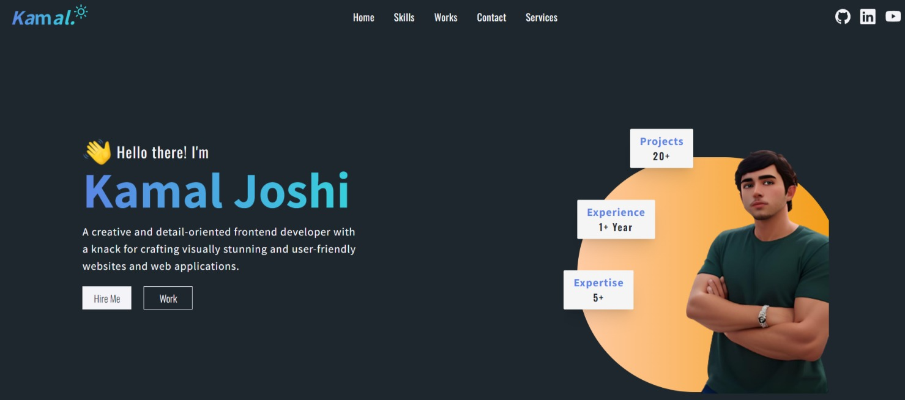

# Portfolio Web App

Welcome to the Portfolio Web App repository! This web application is built to help you showcase your skills, projects, and achievements. It features a modern design and leverages various technologies to create an engaging and responsive user experience.



## Features

- **Responsive Design:** Ensures a seamless user experience across different devices and screen sizes.
- **Project Showcase:** Highlight your projects with detailed information, images, and links.
- **Skills Section:** Showcase your proficiency in various technologies and tools.
- **Contact Form:** Allow visitors to get in touch with you easily via a contact form.

## Technologies Used

- [React](https://reactjs.org/) (v18.2.0)
- [React DOM](https://reactjs.org/docs/react-dom.html) (v18.2.0)
- [React Hook Form](https://react-hook-form.com/) (v7.48.2)
- [Firebase](https://firebase.google.com/) (v10.5.2)
- [Framer Motion](https://www.framer.com/motion/) (v10.16.4)
- [React Hot Toast](https://react-hot-toast.com/) (v2.4.1)
- [React Icons](https://react-icons.github.io/react-icons/) (v4.11.0)
- [React Responsive Carousel](https://www.npmjs.com/package/react-responsive-carousel) (v3.2.23)
- [React Router DOM](https://reactrouter.com/web/guides/quick-start) (v6.18.0)
- [React Router Hash Link](https://www.npmjs.com/package/react-router-hash-link) (v2.4.3)
- [React Spinners](https://www.npmjs.com/package/react-spinners) (v0.13.8)
- [Tailwind CSS](https://tailwindcss.com/) (v3.3.5)
- [Vite](https://vitejs.dev/) (v4.4.5)

## Getting Started

1. **Clone the Repository:**
   ```bash
   [git clone https://github.com/your-username/portfolio-web-app.git](https://github.com/KamalJoshi-web/Personal-Portfolio.git)
   cd portfolio-web-app
   Install Dependencies:
   ```

bash
Copy code
npm install
Configure Personal Information:

Open the src/data/portfolioData.js file.
Update the content with your personal information, projects, and skills.
Run the App:

bash
Copy code
npm start
The app will be accessible at http://localhost:3000 in your browser.

Customization
Feel free to customize the app further to meet your specific needs. You can modify the styling, add new sections, or enhance existing ones.

Deployment
Once you are satisfied with your portfolio, deploy it to a hosting service of your choice. Popular options include GitHub Pages, Netlify, and Vercel.

License
This project is licensed under the MIT License - see the LICENSE file for details.

Acknowledgments
Special thanks to the creators of the tools and libraries used in this project.

Thank you for using the Portfolio Web App! If you have any questions or suggestions, feel free to reach out.

Happy coding! 🚀
